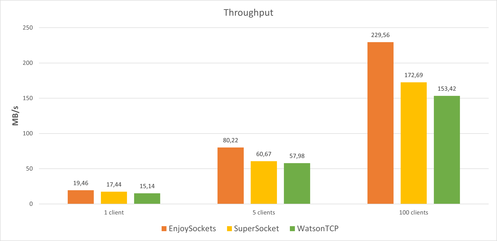

# RTT Performance Benchmark

## What is RTT?

**Round-Trip Time (RTT)** is the duration, measured in milliseconds, from when a client sends a request to when it receives a response from the server. It is a critical metric for real-time systems where low latency is more important than raw throughput.

This benchmark compares three libraries - **EnjoySockets**, **SuperSocket**, and **WatsonTCP** - to demonstrate the architectural differences and performance characteristics of each.

> [\!NOTE]
> This test was specifically designed to determine the performance "tier" of the **EnjoySockets** library. It does **not** measure the full potential of a server-side implementation. For a pure server-side stress test, a different approach (e.g., raw sockets with multi-point load generation) should be used.

-----

## Library Selection

Since **EnjoySockets** is a high-level library, I selected competitors that offer at least the same core built-in features:

  * **Async/Await support**
  * **Message Framing**
  * **Encryption (SSL/TLS)**

### Why these libraries?

  * **SuperSocket**: Described as a high-performance socket framework. An excellent candidate for a "top-tier" comparison.
  * **WatsonTCP**: Extremely simple and meets all requirements. Included partly for its popularity and partly out of sentiment from previous projects.

### Why not NetCoreServer or DotNetty?

  * **NetCoreServer**: Too low-level. I would end up benchmarking my own implementation of framing and protocols rather than the library itself.
  * **DotNetty**: Similar to NetCoreServer, but with a significantly higher entry barrier to implement everything correctly for a fair comparison.

Even **SuperSocket** was considerably more difficult to implement than **WatsonTCP**, requiring several simplifications to work within the test suite.

-----

## Testing Environment & Parameters

### Hardware

  * **CPU**: AMD Ryzen 7 3700X 8-Core Processor @ 3.59 GHz
  * **OS**: Windows 10 Pro, 22H2 (64-bit)
  * **MTU**: 1500

### Project Parameters

  * **Runtime**: .NET 8.0
  * **Payload**: 1028 bytes
  * **Warmup**: 10,000 iterations
  * **Measured Test**: 25,000 iterations
  * **Parallel Clients**: 1, 5, and 100
  * **Build**: Release mode with JIT optimization
  * **Encryption**: Enabled for all libraries
  * **Serialization**: Zero-allocation using the **MemoryPack** library to ensure maximum unification across tests.

-----

## Test Methodology

Each library underwent 10 passes for each client configuration. The best result for each was selected.
One pass consisted of:

1.  Client login/handshake.
2.  1-second pause.
3.  Warmup phase (10k iterations, unmeasured).
4.  Measurement phase (25k iterations, measuring time from "send" to "response received").

### Implementation Notes & Challenges

  * **EnjoySockets**: Very straightforward. It allows a loop where the response is received immediately. Serialization and encryption are built-in.
  * **WatsonTCP**: While it supports a "Response" pattern, I opted for a manual state control approach in the receiving method to avoid potential overhead of newer features. A minor bottleneck is its `byte[]` requirement; to minimize allocations, `ReadOnlyMemory` is copied to a pre-allocated array (though the impact was negligible in testing).
  * **SuperSocket**: Required the most code. Performance is very stable, but I had to override parts of the library to enable `NoDelay` on the client side. For simplicity, I used a fixed message length instead of a `PipelineFilter` with length prefixes.

-----

## Results

### 1 Client

| Library | RTT (msg/s) | Throughput (MB/s) | p50 (ms) | p95 (ms) | p99 (ms) | p999 (ms) | max (ms) |
| :--- | :--- | :--- | :--- | :--- | :--- | :--- | :--- |
| **EnjoySockets** | 19,847 | 19.46 | 0.050 | 0.060 | 0.065 | 0.079 | 0.647 |
| SuperSocket | 17,793 | 17.44 | 0.055 | 0.069 | 0.077 | 0.092 | 0.731 |
| WatsonTCP | 15,442 | 15.14 | 0.065 | 0.085 | 0.096 | 0.123 | 0.445 |

### 5 Clients

| Library | RTT (msg/s) | Throughput (MB/s) | p50 (ms) | p95 (ms) | p99 (ms) | p999 (ms) | max (ms) |
| :--- | :--- | :--- | :--- | :--- | :--- | :--- | :--- |
| **EnjoySockets** | 81,829 | 80.22 | 0.058 | 0.076 | 0.087 | 0.144 | 2.674 |
| SuperSocket | 61,883 | 60.67 | 0.083 | 0.099 | 0.108 | 0.152 | 0.545 |
| WatsonTCP | 59,144 | 57.98 | 0.079 | 0.112 | 0.129 | 0.430 | 1.251 |

### 100 Clients

| Library | RTT (msg/s) | Throughput (MB/s) | p50 (ms) | p95 (ms) | p99 (ms) | p999 (ms) | max (ms) |
| :--- | :--- | :--- | :--- | :--- | :--- | :--- | :--- |
| **EnjoySockets** | 234,156 | 229.56 | 0.390 | 0.554 | 1.429 | 2.194 | 17.318 |
| SuperSocket | 176,143 | 172.69 | 0.557 | 0.588 | 1.197 | 1.611 | 4.083 |
| WatsonTCP | 156,486 | 153.42 | 0.565 | 1.341 | 1.810 | 2.510 | 58.120 |

-----

## Conclusions & Observations

### SuperSocket (2.0.2)

SuperSocket shows remarkable stability and scales very linearly. Its p99 and maximum latency values remain tight even as the number of clients increases. 

This suggests a highly optimized, possibly mirrored architecture for both client and server sides.

### WatsonTCP (6.3.1)

Compared to the earlier benchmark on version (6.1.0), this library shows a significant performance improvement, placing it close behind the two top-performing implementations.

With a higher number of concurrent clients, a small tail-latency becomes noticeable. 

Similar to SuperSocket, the architecture is likely mirrored between the client and server sides. There is still potential for further work on scalability, but overall, the library scales well under increasing load.

### EnjoySockets (1.2.1)

This library achieved the best overall result in this test, demonstrating strong scalability characteristics.

Similarly to WatsonTCP, a slight tail-latency appears under a high number of concurrent clients. This is primarily caused by the client-side design, which includes several developer-friendly mechanisms.

In this benchmark, multiple clients are aggregated within a single application instance. On the client side, this introduces additional overhead such as frequent asynchronous context switching per response, as well as tracking of pending reliable send operations, including lifecycle management and retransmission state handling.

Under heavy client consolidation, this additional resource pressure is reflected as a small tail-latency effect.

It is worth noting that this benchmark represents a synthetic scenario. In typical real-world usage, each client runs as a separate application instance on its own machine, which removes this shared-resource overhead and produces results closer to the single-client performance profile.